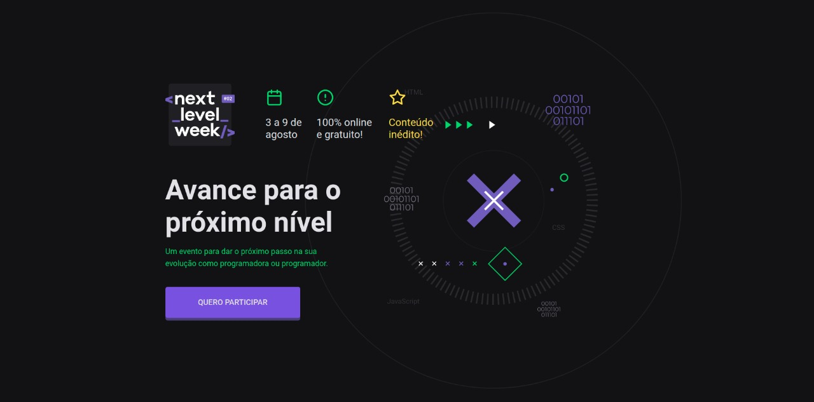
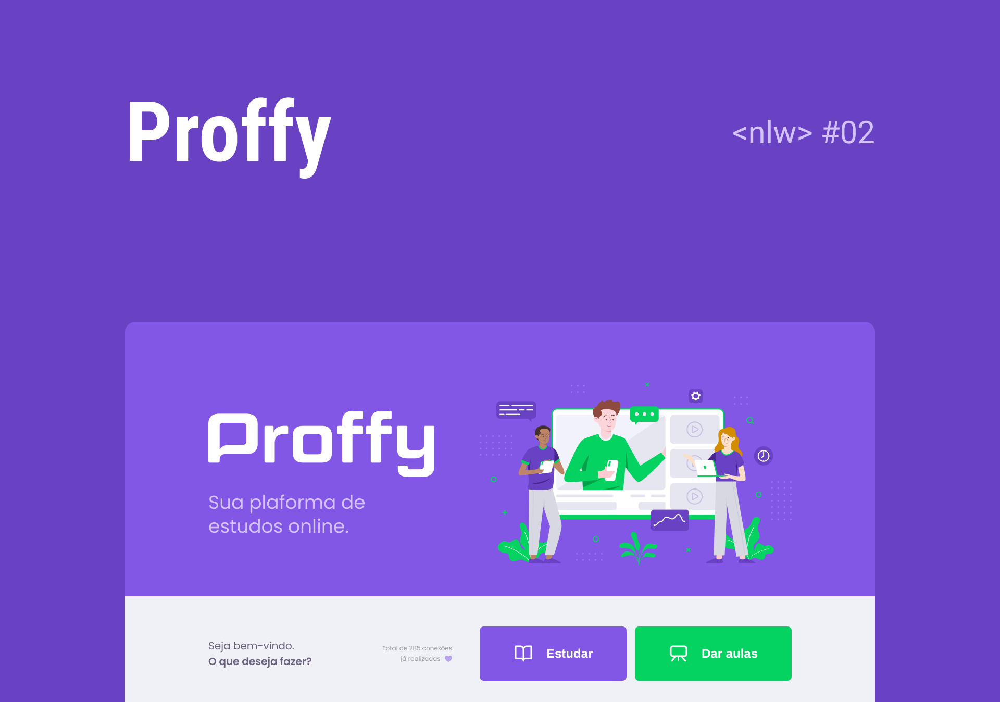

<h1 align="center">
    
</h1>

<h4 align="center">
	<p>NextLevelWeek #02 🚀</p>
  <p>Trilha OmniStack</p>
</h4>
<p align="center">

  

  

  <a href="https://www.linkedin.com/in/pachecowebdev/">
    
  </a>

  <a href="https://github.com/PachecoWebDev/nlw02-omnistack/commits/master">
    
  </a>

  

  <a href="https://github.com/PachecoWebDev/nlw02-omnistack/stargazers">
    
  </a>

</p>
<p align="center">
<a href="https://nodejs.org/en/" rel="nofollow">
    
  </a>

  <a href="https://reactjs.org/" rel="nofollow">
    
  </a>

  <a href="https://reactnative.dev/" rel="nofollow">
    
  </a>
  </p>

## :information_source:  O que é Next Level Week?

<p>A NLW é uma semana prática com muito código, desafios, network e com um único objetivo: levá-lo ao próximo nível.</p>
<p>Programação é uma disciplina prática. Ou seja, para dominar uma tecnologia não basta apenas conhecer a teoria ou ler a documentação: você precisa colocar a mão no código.</p>
<p>Através do método da [Rocketseat][rs], você aprenderá novas ferramentas, tecnologias e descobrirá hacks que irão impulsionar sua carreira.</p>
<p>Uma experiência online e totalmente gratuita para evoluir suas habilidades em programação e colocar mais um trabalho completo no seu portfolio.</p>

## 💻 Projeto

👨‍🏫 Proffy é um projeto desenvolvido com o objetivo de conectar as pessoas que buscam algum tipo de aula particular à profesores que oferecem essas aulas. O Projeto foi desenvolvido seguindo a trilha Discovery da Semana [NLW](https://nextlevelweek.com).

## 🌐  Web

<h3 align="center">
    
</h3>

## 📱 Mobile

<h3 align="center">
    
</h3>

## :hammer: Tecnologias

Este projeto foi desenvolvido com as seguintes Ferramentas:

- [Node.js][nodejs]
- [TypeScript][typescript]
- [React][reactjs]
- [React Native][rn]
- [Expo][expo]
- [VS Code][vs]

## 🚀 Como rodar este projeto

Para clonar e executar este aplicativo, você precisará de [Git](https://git-scm.com), [Node.js][nodejs] Instalado em seu computador.

O projeto e divido em três partes:

1. Back-End (pasta server)
2. Front-End (pasta web)
3. Mobile (pasta mobile)

💡 Tanto o Front-End quanto o Mobile precisam que o Back-End esteja sendo executado para funcionar.

### :cyclone: Clonando o repositório

```bash
# Clone este repositório
$ git clone https://github.com/PachecoWebDev/nlw02-omnistack

# Acesse a pasta do projeto no terminal/cmd
$ cd nlw02-omnistack
```

### 🎲 Rodando o Back End (servidor)

```bash
# Acesse a pasta do projeto do servidor
$ cd server

# Instale as dependências
$ npm install

# Acesse a pasta com a configuração do BD
$ cd src/database

Edita o arquivo 'connection.ts' ou cria um arquivo 'database.sqlite' na pasta database

# Execute as Migrates
$ npm run knex:migrate

# Execute a Aplicação
$ npm run start

# O servidor inciará na porta:3333 - acesse http://localhost:3333

```

### 🧭 Rodando a aplicação web (Front End)

```bash

# Vá para a pasta da aplicação Front End
$ cd web

# Instale as dependências
$ npm install

# Execute a aplicação
$ npm run start

# A aplicação será aberta na porta:3000 - acesse http://localhost:3000
```

### 📱Rodando a aplicação mobile

```bash
# Vá para a pasta da aplicação Front End
$ cd mobile

# Instale as dependências
$ npm install

# Execute a aplicação
$ expo start

# A aplicação será aberta na porta:19002 - acesse http://localhost:19002

# Use o App expo baixado no seu celular para scan o QRCode
```

## 🤔 Como contribuir para o projeto

- Faça um **fork** do projeto;
- Crie uma nova branch com as suas alterações: `git checkout -b my-feature`
- Salve as alterações e crie uma mensagem de commit contando o que você fez:`git commit -m "feature: My new feature"`
- Envie as suas alterações: `git push origin my-feature`

> Caso tenha alguma dúvida confira este [guia de como contribuir no GitHub](https://github.com/firstcontributions/first-contributions)

## :memo: Licença

Este projeto esta sobe a licença MIT. Veja a [LICENÇA][license] para saber mais.

Att. Anderson Pacheco 👨‍💻  [Vamos conversar!](https://www.linkedin.com/in/anderson-pacheco-oliveira-506474a1)

[nodejs]: https://nodejs.org/
[typescript]: https://www.typescriptlang.org/
[expo]: https://expo.io/
[reactjs]: https://reactjs.org
[rn]: https://facebook.github.io/react-native/
[vs]: https://code.visualstudio.com/
[rs]: https://rocketseat.com.br
[license]: https://opensource.org/licenses/MIT
